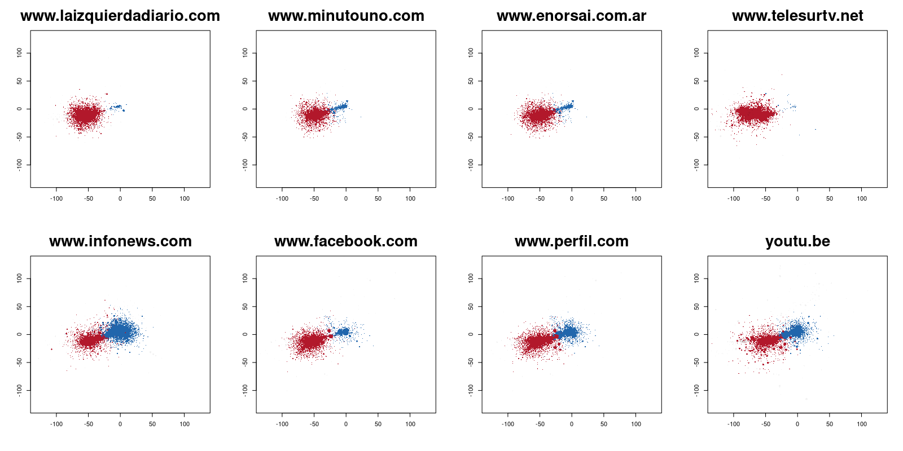
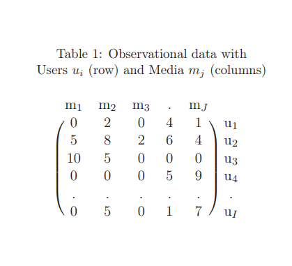
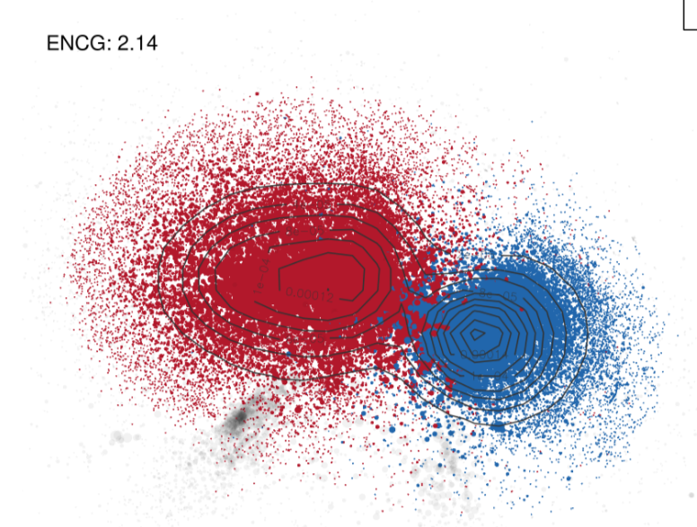
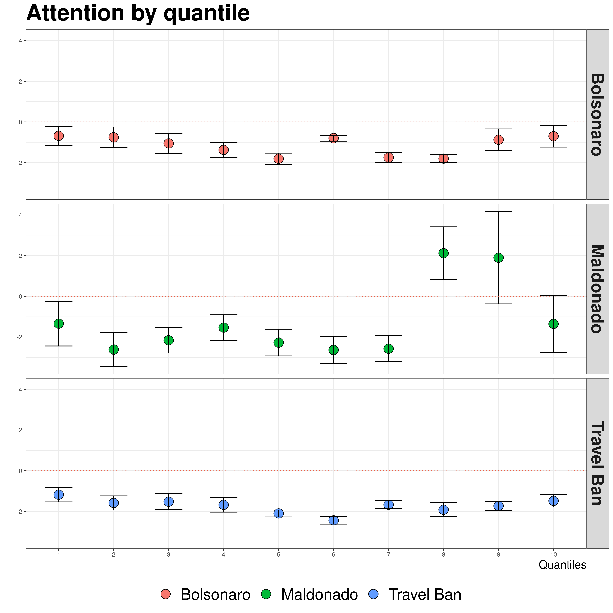
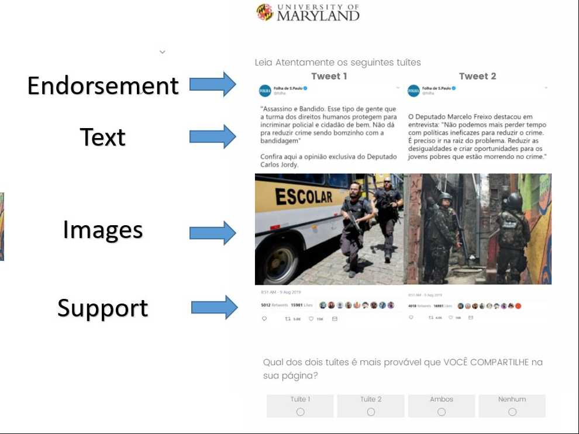
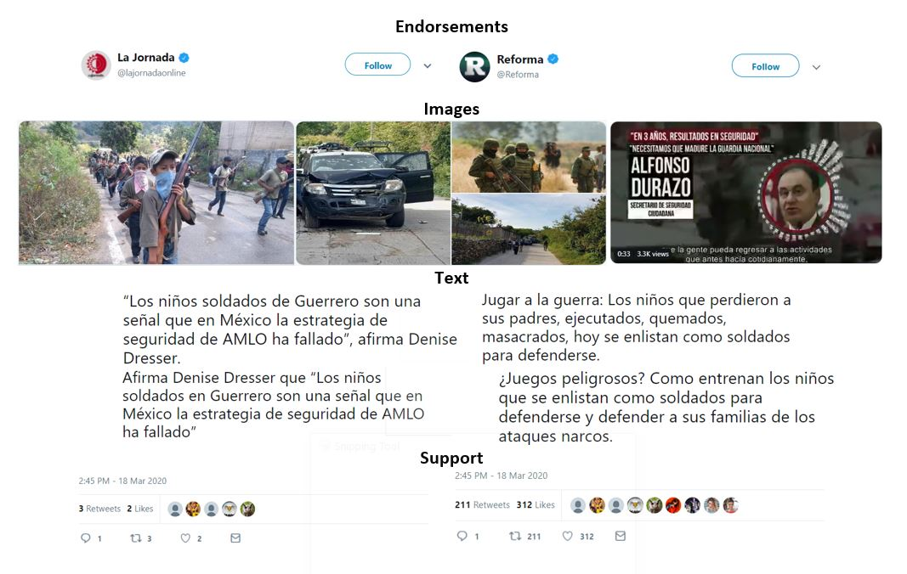
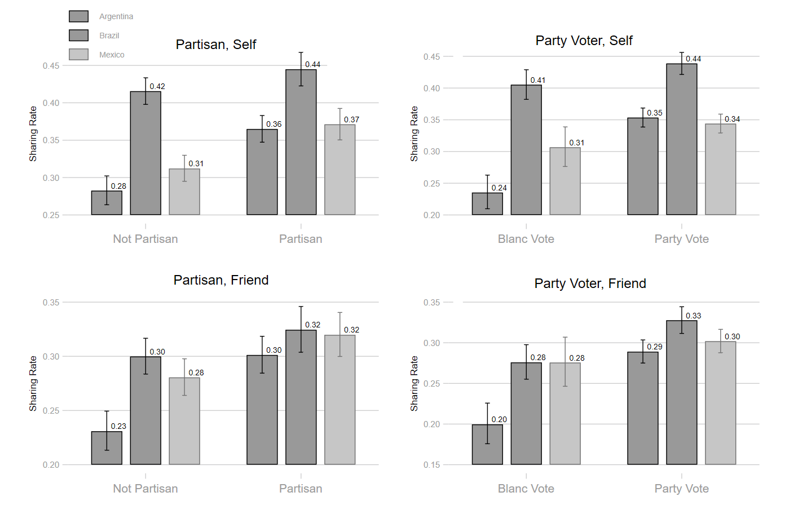
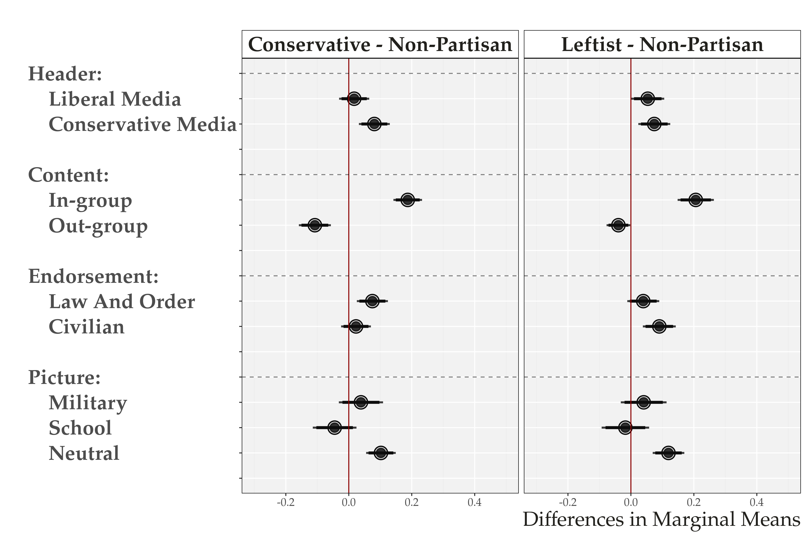
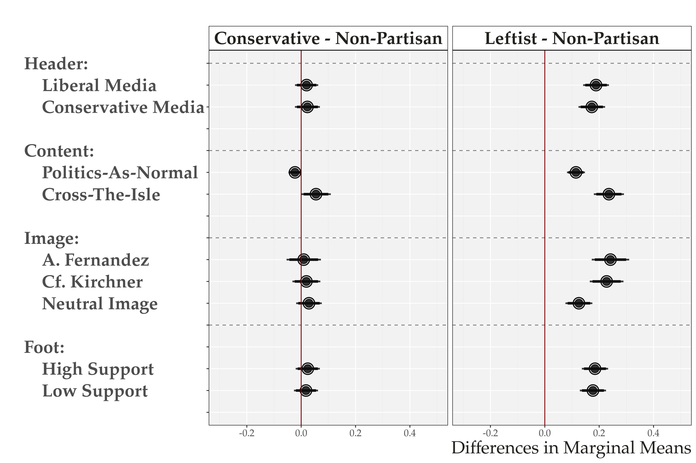

```{r setup, include=FALSE}
options(htmltools.dir.version = FALSE)
knitr::opts_chunk$set(messagwese=FALSE, warning = FALSE)
xaringanthemer::style_mono_accent(base_color ="#23395b", 
                                  title_slide_text_color="#23395b", 
                                  title_slide_background_color = "#fff", 
                                  background_color = "#fff", 
                                  link_color =  "#C93312")

options(htmltools.dir.version = FALSE)
knitr::opts_chunk$set(message=FALSE, warning = FALSE, error=TRUE, echo=FALSE, cache=TRUE)
```

```{r style-share-again, echo=FALSE}
xaringanExtra::use_tile_view()
xaringanExtra::use_panelset()

#xaringanExtra::style_share_again(
#  share_buttons = c("twitter", "linkedin", "pocket")
#)
```

name: about-me
layout: false
class: about-me-slide, inverse, middle, center


## .red[About me]


### Tiago Ventura 

.fade[Postdoc no Centro de Mídias Socias e Política, NYU]

.fade[Professor Assistente na Universidade de Georgetown]

.fade[PhD Government and Politics, University of Maryland, College Park]

[`r icons::simple_icons("twitter")` @TiagoVentura_](https://twitter.com/_Tiagoventura)
[`r icons::simple_icons("github")` TiagoVentura](https://github.com/TiagoVentura)
[`r icons::ionicons("mail")` venturat@umd.edu](venturat@umd.edu)
[`r icons::ionicons("link-outline")`https://tiagoventura.rbind.io/](https://venturatiago.com/)


---
class:middle 
## Planos de hoje

--

#### .red[Projeto de livro:] News sharing, content activation and perceived polarization on social media 

- [News Sharing, Gatekeeping and Polarization (*Digital Journalism*)](https://www.tandfonline.com/doi/abs/10.1080/21670811.2020.1852094)

- [News by Popular Demand (*IJPP*)](https://journals.sagepub.com/doi/abs/10.1177/19401612211057068)

- [Network Activated Frames (Under Review)](https://tiagoventura.rbind.io/files/naf.pdf) 

---
class:inverse, middle, center

## Compartilhamento de Notícias, Ativação de Conteúdo e Percepções de Polarização nas Redes

---
class:middle 

### .center[.blue[Redes Sociais ampliam auto-seleção]]

### .center[`r icons::fontawesome("arrow-alt-circle-down")`]

### .center[.blue[Câmaras-de-eco]]

#### .center[`r icons::fontawesome("arrow-alt-circle-down")`]

### .center[.blue[Redução de exposição a conteúdo cruzado]]

### .center[`r icons::fontawesome("arrow-alt-circle-down")`]

### .center[.red[Polarização]]


---
class: middle

### As Câmaras-de-Eco são reais? 

- Auto-seleção online é similar a offline em diversos países ao redor do mundo .red[(Gentzkow and Shapiro, 2011; Wojcieszak  and  Mutz, 2009; Bisbee and Larsson, 2017)]

- Nossa rede de amizades nas mídias sociais são em geral bem heterogêneas .red[(Bakshy et al. 2012; Barbéra  et  al., 2 015)]

- O conteúdo do que visitamos  on-line e das notícias que clicamos são em média balanceadas, e fortemente composta por jornais e sites de grande circulação .red[(Guess 2021; Cardenal et. al., 2019)]

---
class:inverse, middle, center

# `r icons::fontawesome("question")`

###  A maioria dos usuários está inserida em diversas redes sociais online onde a moderação é a norma, mas as percepções de um ambiente de mídia social altamente polarizado ainda são particularmente difundidas.


---
class: middle
## Porque isso importa?


Estudos diversos na ciência política mostram que polarização influencia:

- Apoio a saídas anti-democráticas

- Apoio a violência política

- Distorce percepções factuais da realidade

- Dificultam cooperação entre cidadãos

Entre outros efeitos...


---
class: middle

## A contribuição de nossos estudos

--
#### `r icons::fontawesome("arrow-alt-circle-right")` Activação vs Auto-seleção: .red[*A propagação de conteúdo nas redes sociais depende fundamentalmente da decisão do usuário de compartilhar conteúdo*] 

--

#### `r icons::fontawesome("arrow-alt-circle-right")`  .red[Bolhas de Ativação ] podem emergir mesmo quando usuários estão entrelaçados em redes moderadas our heterogêneas (Composição vs Seleção)

--

#### `r icons::fontawesome("arrow-alt-circle-right")` .red[*Usuários com fortes preferências partidárias*] são também mais motivados, mais ativods `r icons::fontawesome("arrow-alt-circle-right")`  .red[*conteúdos mais ideológicos*] serão super-representados  `r icons::fontawesome("arrow-alt-circle-right")`  o usuário médio termina por experimentar  .red[*mais conteúdo partidário*] do que a prevalência deste conteúdo na rede.

--


---
class: middle, inverse, center

## Um modelo de Ativação de Conteúdo: Modelando o Compartilhamento de Notícias com Dados de Mídias Sociais. 
---
class: middle
## Compartilhamento de Notícias: Coleta de Dados

**Casos**:  .red[Brasil, Argentina, e Estados Unidos]

**Fonte**: Twitter API.

**Pre-Processamento**: 

- Construiu-se uma rede de retuítes com os maiores clusters conectados.

- Desenhou-se as coordenadas [x,y] dos usuários implementando o algoritmo Fruchterman-Reingold

- Algoritmo de detecção de comunidade Walk-trap.

- Pesquisa de consulta Regex para hiperlinks incorporados (DV).

#### 10 milhões de retweets + 500 mil usuários


---
### Bolhas de Ativação

.panelset[

.panel[.panel-name[Brasil]

.center[
```{r out.width="100%"}
knitr::include_graphics("./figs/EmbeddedNews1Bolsonaro.png")
```
]


]

.panel[.panel-name[Argentina]

.center[
```{r out.width="100%"}

```
]
]

.panel[.panel-name[US]

.center[
```{r out.width="100%"}
knitr::include_graphics("./figs/EmbeddedNews1travelban_large.png")
```
]
]
]

---
## News Sharing: Model 

.center[
```{r out.width="100%"}
knitr::include_graphics("./figs/Calvo-NBPD-Facebook.jpg")
```
]

---

## Modelagem Estatística

.center[
$y_{ij} \sim \mbox{Po}(\mu_i)$

$\mu_i = \exp(\alpha_{i[q]}\left(x_{i}-L_{j}\right)^2 + A_{[q]} + R_{[j]} + \gamma_{[i]})$
]

.pull-left[.center[
```{r out.width="100%"}

```
]]

.pull-right[.center[
#### Rede de Bolsonaro Twitter
```{r out.width="100%"}

```
]]

---
## Resultado: Ideologia

.center[
```{r out.width="65%"}
knitr::include_graphics("./figs/ideo_flip.png")
```
]

---
## Resulta: Atenção

.center[
```{r out.width="65%"}

```
]

---
## Posição ideológica das Mídias


.pull-left[
```{r out.width="100%"}

```
]

.pull-right[
```{r out.width="100%"}

```
]


---

## Conclusão: Atenção e Ideologia

.pull-left[
**Forte correlação entre ideologia e atenção:**

- Usuários mais partidários compartilham mais conteúdo

- O conteúdo partidário será super-representado.

- Bolhas de mídia social surgirão da ativação, mesmo que as redes sejam heterogêneas.
]

.pull-right[
```{r out.width="100%"}
knitr::include_graphics("./figs/corr_figure.png")
```
]


---

class: middle

## .red[*Dados observacionais não conseguem separar casualmente ativação e auto-seleção*]

--

**Solução**: Desenho Experimental de Conjoint

Mostrar diversos cenários diferentes para pessoas respondendo surveys e perguntar qual elas compartilhariam. 

Surveys on-line. Não significa que elas estão de fato compartilhando. 

--

---
## Desenho Experimental

.panelset[

.panel[.panel-name[Brasil]

.center[
```{r out.width="70%"}

```
]


]

.panel[.panel-name[Argentina]

.center[
```{r out.width="70%"}
knitr::include_graphics("./figs/ElementsArgentina.JPG")
```
]
]

.panel[.panel-name[Mexico]

.center[
```{r out.width="80%"}

```
]

]
]


---
class: middle


.pull-left-narrow[

#### .red[Hipotheses] 

]

.pull-right-wide[

- *H1: Usuários partidários serão incondicionalmente mais motivados do que eleitores não partidários para compartilhar conteúdo político.*

- *H2: Os usuários compartilharão conteúdo congruente que se alinham politicamente com as suas preferênciasartidários (congruência cognitiva em grupo)*

] 


---
## H1: Taxa de compartilhamento

```{r out.width="100%"}

```


---
## H2: Ativação de Enquadre

.panelset[

.panel[.panel-name[Brasil]

.center[
```{r out.width="85%"}

```
]
]


.panel[.panel-name[Argentina]

.center[
```{r out.width="85%"}

```
]
]

.panel[.panel-name[Mexico]

.center[
```{r out.width="85%"}
knitr::include_graphics("./figs/mx_self_mm_gu.png")
```
]
]
]

---
class: middle
## Principais Conclusões

--

`r icons::fontawesome("arrow-alt-circle-right")` **Evidência experimental de que uma rede social com seleção vinda de  .red[probabilidades uniformes aleatórias] produzirá enquadres que irão .red[sobre-representar] as preferências dos seus membros mais ativos**

--

`r icons::fontawesome("arrow-alt-circle-right")` **Assim como com dados observacionais, bolhas emergem de .red[propagação] formada como consequência da correlação entre .red[atenção e ideologia]**

--

`r icons::fontawesome("arrow-alt-circle-right")` **Dinâmicas de como funcionam as redes sociais criam um eco-sistema onde  .red[até usuários não polarizados] são expostos a .red[conteúdo fortemente ideológico] **

--

`r icons::fontawesome("arrow-alt-circle-right")` **Mais importante: usuários em redes mais polarizadas costumam observar somente o que há de mais polarizado do lado aposto. **

--

---
class:inverse, center, middle

## Obrigado!
