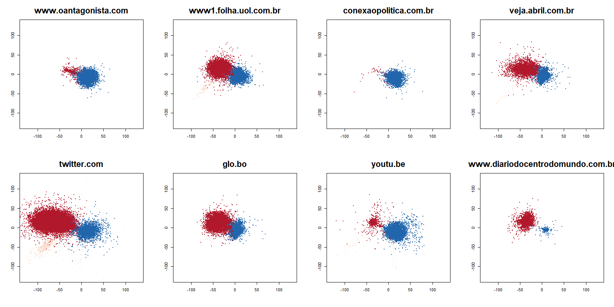

```{r setup, include=FALSE}
options(htmltools.dir.version = FALSE)
knitr::opts_chunk$set(messagwese=FALSE, warning = FALSE)
xaringanthemer::style_mono_accent(base_color ="#23395b", 
                                  title_slide_text_color="#23395b", 
                                  title_slide_background_color = "#fff", 
                                  background_color = "#fff", 
                                  link_color =  "#C93312")

options(htmltools.dir.version = FALSE)
knitr::opts_chunk$set(message=FALSE, warning = FALSE, error=TRUE, echo=FALSE, cache=TRUE)
```

```{r style-share-again, echo=FALSE}
xaringanExtra::use_tile_view()
xaringanExtra::use_panelset()

#xaringanExtra::style_share_again(
#  share_buttons = c("twitter", "linkedin", "pocket")
#)
```

name: about-me
layout: false
class: about-me-slide, inverse, middle, center


## .red[About me]


### Tiago Ventura (He/Him)

### Researcher Civic Integrity at Twitter

.fade[PhD Government and Politics, University of Maryland, College Park]

[`r icons::simple_icons("twitter")` @TiagoVentura_](https://twitter.com/_Tiagoventura)
[`r icons::simple_icons("github")` TiagoVentura](https://github.com/TiagoVentura)
[`r icons::ionicons("mail")` venturat@umd.edu](venturat@umd.edu)
[`r icons::ionicons("link-outline")`https://tiagoventura.rbind.io/](https://tiagoventura.rbind.io/)


---
class:middle 
## Plans for the talk

--

#### .red[Book Project:] News Sharing, content activation and perceived polarization on social media 

--

#### Overview of my research agenda

- Political Communication 

- New Methods in CSS 

- Comparative Politics

---
class:inverse, middle, center

## News Sharing, Content Activation and Perceived Polarization on Social Media

---
class:middle 

### .center[.blue[Social media increases sorting]]

### .center[`r icons::fontawesome("arrow-alt-circle-down")`]

### .center[.blue[Echo Chambers]]

#### .center[`r icons::fontawesome("arrow-alt-circle-down")`]

### .center[.blue[Reduce cross-cutting exposure]]

### .center[`r icons::fontawesome("arrow-alt-circle-down")`]

### .center[.red[Polarization]]


---
class: middle

### Are social media echo-chambers real? 

- Online Sorting is similar to offline levels .red[(Gentzkow and Shapiro, 2011; Wojcieszak  and  Mutz, 2009)]

- Users' friendship networks are heterogeneous outside of politics .red[(Bakshy et al. 2012; Barbéra  et  al., 2 015)]

- Users’ digital media diets are balanced, and strongly influenced by big reputable outlets .red[(Guess 2021)]

---
class:inverse, middle, center

# `r icons::fontawesome("question")`

###  Most users are embedded in diverse online social networks where moderation is the norm, yet  perceptions of a highly polarized social media environment are still particularly widespread.


---
class: middle

## Core argument

--
#### `r icons::fontawesome("arrow-alt-circle-right")` Activation vs Sorting: .red[*Propagation on social media depends fundamentally on the users’ sharing decision*] 

--

#### `r icons::fontawesome("arrow-alt-circle-right")`  .red[Activation bubbles] may emerge, even if users are embedded on heterogenous networks. (Composition vs Selection)

--

#### `r icons::fontawesome("arrow-alt-circle-right")` .red[*Partisan users*] are more issue-motivated `r icons::fontawesome("arrow-alt-circle-right")`  .red[*partisan content*] will be over-represented `r icons::fontawesome("arrow-alt-circle-right")`  the average user experiences .red[*more partisan content*] than the prevalence of partisans.

--


---
class: middle, inverse, center

## News Sharing Model: Modeling Sharing Behavior on Social Media Data

---
class: middle
## News Sharing: Data Collection

**Cases**:  .red[Brazil, Argentina, and the United States]

**Source**: Twitter APIs, Forward stream and the backward search

**Pre-Processing**: 

- Built a network of retweets with the largest connected clusters. 

- Draw users’ [x,y] coordinates implementing the Fruchterman-Reingold algorithm

- Walk-trap community detection algorithm. 

- Regex query search for embedded hyperlinks (DV). 

#### Close to 10 millions retweets + 500 thousand accounts.


---
### Activation Bubbles in Social Media

.panelset[

.panel[.panel-name[Brazil]

.center[
```{r out.width="100%"}

```
]


]

.panel[.panel-name[Argentina]

.center[
```{r out.width="100%"}
knitr::include_graphics("./figs/EmbeddedNews2maldonado_large.png")
```
]
]

.panel[.panel-name[United States]

.center[
```{r out.width="100%"}

```
]
]
]

---
## News Sharing: Model 

.center[
```{r out.width="100%"}

```
]

---

## News Sharing: Estimation

.center[
$y_{ij} \sim \mbox{Po}(\mu_i)$

$\mu_i = \exp(\alpha_{i[q]}\left(x_{i}-L_{j}\right)^2 + A_{[q]} + R_{[j]} + \gamma_{[i]})$
]

.pull-left[.center[
```{r out.width="100%"}
knitr::include_graphics("./figs/matrix.png")
```
]]
.pull-right[.center[
#### Bolsonaro Twitter Network 
```{r out.width="100%"}
knitr::include_graphics("./figs/net_b.png")
```
]]

---
## Results: Ideology

.center[
```{r out.width="65%"}

```
]

---
## Results: Attention

.center[
```{r out.width="65%"}
knitr::include_graphics("./figs/att_flip.png")
```
]
---

## Conclusion: Attention and Ideology

.pull-left[
**Strong correlation between ideology and attention:**

- More partisan users share more content

- Partisan content will be over-represented.

- Social media bubbles will emerge from activation, even if networks are heterogenous.

]

.pull-right[
```{r out.width="100%"}

```
]


---

class: center, middle

## .red[*Observational data cannot fully separate activation from sorting.]*


---
## Image-Based Conjoints

.panelset[

.panel[.panel-name[Brazil]

.center[
```{r out.width="70%"}
knitr::include_graphics("./figs/ElementsBrazil.png")
```
]


]

.panel[.panel-name[Argentina]

.center[
```{r out.width="70%"}

```
]
]

.panel[.panel-name[Mexico]

.center[
```{r out.width="80%"}
knitr::include_graphics("./figs/ElementsMexico.JPG")
```
]

]
]


---
class: middle


.pull-left-narrow[

#### .red[Hypothesis] 

]

.pull-right-wide[

- *H1: Partisan users will be unconditionally more issue motivated than non-partisan voters to share political content.*

- *H2: Users will share congruent content that aligns politically with the preferences of their co-partisans (in-group cognitive congruence)*

- *H3: Partisan users expect their friends to share more partisan frames*
] 


---
## H1: Sharing-Rate

```{r out.width="100%"}
knitr::include_graphics("./figs/sharing_naf.png")
```


---
## H2: Framing Activation

.panelset[

.panel[.panel-name[Brazil]

.center[
```{r out.width="85%"}
knitr::include_graphics("./figs/br_self_mm_gu.png")
```
]


]

.panel[.panel-name[Argentina]

.center[
```{r out.width="85%"}
knitr::include_graphics("./figs/ar_self_mm_gu.png")
```
]
]

.panel[.panel-name[Mexico]

.center[
```{r out.width="85%"}

```
]
]
]

---
## H3: Would your friend share?

.panelset[

.panel[.panel-name[Brazil]

.center[
```{r out.width="85%"}

```
]


]

.panel[.panel-name[Argentina]

.center[
```{r out.width="85%"}

```
]
]

.panel[.panel-name[Mexico]

.center[
```{r out.width="85%"}

```
]
]
]

---
class: middle
## Main Take Aways

--

`r icons::fontawesome("arrow-alt-circle-right")` **Experimental evidence that a social network with inputs from .red[random uniform probabilities] will output frames that will .red[over-represent] the preferences of partisan respondents**

--

`r icons::fontawesome("arrow-alt-circle-right")` **As in observational data, bubbles emerge from .red[propagation] formed as a consequence of statistical  correlation between .red[attention and ideology]**

--

`r icons::fontawesome("arrow-alt-circle-right")` **Affordances from social media activation creates an ecosystem where .red[even non-sorted users] are exposed to .red[more ideological content] on social media**

--

---
class: middle, center
## Policy Implications

--

#### Slowing Sharing Behavior: Double-Click Retweet.

--

---
class:center, middle, inverse

## Overall Research Agenda

#### *.red[And its CSS applications]*


---
## Overall Research Agenda

<br>

.panelset.sideways[

.panel[.panel-name[Political Communication]

**Streaming Chats**: 

- [Political Effects of Streaming Chats](https://osf.io/r6muc/): Field Digital Experiment 

- [Toxicity and Streaming Chats on Facebook](https://journalqd.org/article/view/2573): Develop scrappers to collect more 100k chatboxes' comments from Facebook

**Misinformation**

- [Truth be Told: Cognitive moderators of selective sharing of fact-checks on social media](https://tiagoventura.rbind.io/files/ABCVV_truth_be_told.pdf): Collaboration with Chequeado + Large Scale Data Collection + Survey Experiment

- [Doubt the Messenger: The reputation cost of fact-checking](https://mfr.osf.io/render?url=https://osf.io/ya274/?direct%26mode=render%26action=download%26mode=render)

]


.panel[.panel-name[CSS Methods]

- Strategies to work with Big Social Media Network Data: [The Path-Weighted Regression Model](https://methods.sagepub.com/book/research-methods-in-political-science-and-international-relations/i4823.xml) 

- Image-Based Behavioral Experiments: [social media activation](https://www.dropbox.com/s/r23wwboo6mirpq0/naf.pdf?dl=0)

- Natural Language Processing: Word Embeddings for Ideal-Points Estimation.

]

.panel[.panel-name[Comparative Politics]

As a Political Scientist, most of my work focuses on issues of **criminal violence, security policies, and preferences for law and order candidates** in Latin America.

- [A Network Approach to Crime Victimization](https://tiagoventura.rbind.io/files/net.pdf): Novel network strategies to model overdispersion of crime. 

- [Who owns the issue of security in fragmented democracies?](https://www.dropbox.com/s/e7p9v4ezmpf4ppt/Legislating_for_Violence.pdf?dl=0): 140k Legislative Speeches (Audio + Text) - Topic Models + NLP.

- [Criminal Organizations and provision of public goods during Covid-19 pandemic](https://egap.org/project/criminal-governance-amid-the-covid-19-pandemic-explaining-violence-and-goods-provision-as-public-health-responses-by-organized-crime-groups-in-mexico/): Facebook Ads to target hard-to-reach population

]
]


---
class:inverse, middle

```{r  echo=FALSE, out.width= '100%'}

```

---
class:inverse, center, middle

## Thank you

---
class:inverse, center, middle

## Extra Slides

---
#### Path-Weighted Regression Model (With J. Timoneda and E. Calvo)

.panelset[

.panel[.panel-name[Problem]
#### How to model network dependency with Big Data?

- Most network models are to computationally intensive for large networks.

- Solution: Model Locally + Weighted by Closest Paths

- Extension of Geographically Weighted Regression Model

- Use Cross-Validation to Determine Optimal Number of Paths

- Allows to model heterogeneity on networks and easy to paralelize.
]

.panel[.panel-name[Results]

.center[


```{r  echo=FALSE, out.width= '70%'}
knitr::include_graphics("./figs/slope_cwr.png")
```

CB Ford’s testimony. time to retweet ~ In-degree

]
]
]


---
class:middle, center, inverse

## NAF Extra: Argentina Conjoint

---

## Framing Activation (Partisans vs Non-Partisans)

```{r out.width="90%"}

```


---
## Expectations in the Network

```{r out.width="90%"}

```

---
class:inverse, middle, center

## Mexico Conjoint

---

## Framing Activation (Partisans vs Non-Partisans)

```{r out.width="90%"}

```


---
## Expectations in the Network

```{r out.width="90%"}

```

---

class:inverse, middle, center

## Streaming Chats: Extra

---

## New Technologies: Streaming Chats

.panelset[

.panel[.panel-name[Streaming Chats]

.pull-left[

**Video Feed + Social Chat: All in one screen.**

Popular among the younger generations.

- Twitch (Amazon)
- YouTube/YouTube Gaming (Google)
- Mixer (Microsoft)
- Facebook Lives
]
.pull-right[
```{r out.width="80%"}

```
]
]

.panel[.panel-name[Field Experiment]


We conducted a large scale ''field" experiment that assigns would-be debate viewers to watch on different platforms the October 2019 Democratic Debate.

Two-Wave On-line Survey in September 2019 through MTurk (following Gross, Porter and Wood, 2019). 

**Three main experimental conditions**

- Control (standard NBC broadcast)
- Expert chat (538 website)
- Streaming chat (Facebook)

We then surveyed the respondents after the debate and measured the effects of streaming chats. 
]

.panel[.panel-name[Observational Setup]

#### Text Analysis

To complement our analysis, we built automatic scrapper (Selenium) to collect comments on facebook pages

- One Hundred Thousand Comments  from Facebook pages.

- Several Expert Chats

- Performed Dictionary Methods Sentiment Analysis. 

- Deep Learning Models to identify toxicity. 


]

.panel[.panel-name[Next Steps]

#### Grant under review to: 

- Deploy a similar experiment in Brazil, during the Presidential Election

- Combine the field experiments with collection of web-browsing data

- Measure behavioral mechanisms with a laboratory experiment

]
]
---

---
### High Frequency


.center[
```{r  echo=FALSE, out.width= '80%'}
knitr::include_graphics("figs/freq-bind.png")
```
]
---
### Much more toxic:

.center[
```{r  echo=FALSE, out.width= '80%'}
knitr::include_graphics("figs/proportion_toxicity.png")
```
].footnote[Deep Learning Models from Google Perspective API]

---
### Contains Mostly Negative Primes

.center[
```{r  echo=FALSE, out.width= '80%'}
knitr::include_graphics("figs/topics_3by_cand.png")
```
]

---
#### Mostly Negative Polarity about the Candidates

.center[
```{r  echo=FALSE, out.width= '80%'}
knitr::include_graphics("figs/polarity_candidates.png")
```
]

---
class:inverse, middle, center

## Experimental Results

---
## Frequency and Toxicity Hypotheses
.center[
Facebook chat somewhat less informative, enjoyable, and engaging
```{r  echo=FALSE, out.width= '80%'}
knitr::include_graphics("figs/frequencyplot.png")
```
]

---
## Feeling Thermomethers about the Candidates

```{r  echo=FALSE, out.width= '80%'}
knitr::include_graphics("figs/ftplot.png")
```

---
## Content Effect
.center[
```{r  echo=FALSE, out.width= '80%'}
knitr::include_graphics("figs/ft_on_negative_comments.png")
```
]


---
## Poll Performance

```{r  echo=FALSE, out.width= '80%'}
knitr::include_graphics("figs/pollplot.png")
```

---
## Context Effect
.center[
```{r  echo=FALSE, out.width= '80%'}
knitr::include_graphics("figs/polls_on_positive_comments.png")
```
]

---
## Summary

.pull-left[
**Main Findings**:

- Creates worse viewing experience.

- May disproportionately negatively affect certain candidates subject to toxic, negative comments.

- May distort inferences about candidate viability.

]

.pull-right[
**Next Steps**:

- More research on the mechanism (laboraty experiments).

- More comparative evidence (Does it replicate to other plataforms or other countries?). 

- More descriptive evidence about these news technologies.

]

---
class:middle, center, inverse

### Comparative Politics, Violence and CSS

---

## CSS and Political Violence

.panelset[

.panel[.panel-name[Legislating For Violence]

.pull-left[

140 thousand legislative speeches in Brazil (text + audio) 

- Topic modeling to detect speeches about violence + ML Models to detect Issue Ownership.

**Next Steps**: Modern NLP Techniques (Word Embeddings) 

- Emotions in context (word2vec + cossine similarity + dictionary)

- Scaling of policy preferences (doc2vec)

]

.pull-right[

```{r out.width="100%"}


```

]
]

.panel[.panel-name[Social Networks of Victimization]

.pull-left[

Novel network models to estimate contextual victimization

- How many friends do you know that had a kid last year?

- How many Silvia do you know?

- How many friend do you know that work as teachers?

- .red[How many friends do you know that were victims of crime?]

]

.pull-right[

.center[
```{r  echo=FALSE, out.width= '100%'}
knitr::include_graphics("./figs/dendogram.png")
```
]
]
]

.panel[.panel-name[Facebook Surveys]

.pull-left[
.center[
```{r  echo=FALSE, out.width= '100%'}

```
]
]


.pull-right[

.center[

**EGAP COVID-19 grant**

```{r  echo=FALSE, out.width= '60%'}

```
]
]
]
]

---

## Statistical Model for News Sharing

The estimation of the utility function for sharing uses a multilevel overdispersed poisson model. 

.center[
$y_{ij} \sim \mbox{Po}(\mu_i)$

$\mu_i = \exp(\alpha_{i[q]}\left(x_{i}-L_{j}\right)^2 + A_{[q]} + R_{[j]} + \gamma_{[i]})$
]

Where:

* $y_{i}$ = Number of links embedded by user x media

* $\alpha_{q}$ = Random Slope by quantile 

* $A_{q}$ = Random intercept by quantile

* $R_{j}$ = Random intercept by media outlet 

* $\gamma_{[i]}$ = Overdispersion parameter


